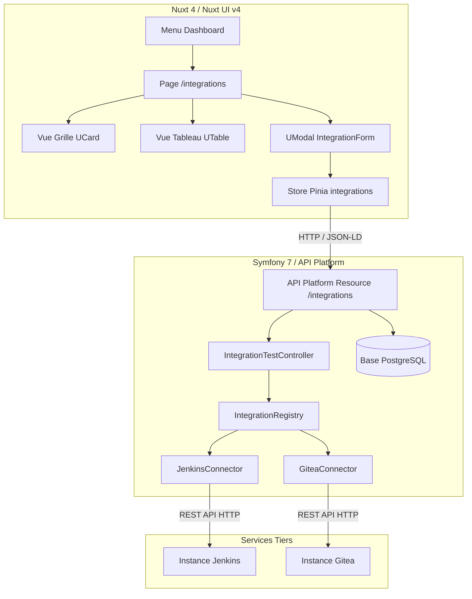

# Requirements

### Overview & Goals
L'objectif de cette fonctionnalité est d'introduire un système modulaire et extensible d'**intégrations** (connecteurs vers des outils externes tiers tels que Jenkins, Gitea, GitLab, etc.).
Ces intégrations permettent à l'application de dialoguer avec des services d'intégration continue, des forges logicielles ou des plateformes tierces. Elles seront administrables et testables directement depuis une interface dédiée dans le frontend Nuxt 4, avec la capacité de s'appuyer de manière facultative sur l'entité `Server` déjà existante dans le projet.

### Scope
- **In Scope :**
  - Modélisation de l'entité `Integration` et de son repository dans le backend Symfony / API Platform.
  - Relation `ManyToOne` facultative entre `Integration` et l'entité `Server` (permettant soit de réutiliser un serveur existant, soit de configurer l'URL/jeton en direct).
  - Architecture en registre de connecteurs (`IntegrationConnectorInterface`, `IntegrationRegistry`) permettant d'ajouter facilement de nouveaux connecteurs.
  - Implémentation initiale de deux connecteurs : **Jenkins** et **Gitea**.
  - Endpoint API Platform dédié au diagnostic et test de connexion (`POST /integrations/{id}/test` et `POST /integrations/test`).
  - Génération des types, stores Pinia et composants Nuxt UI v4 via le script `client-generator`.
  - Création d'une page frontend complète `/integrations` avec bascule Grille / Tableau, modales d'ajout / modification, et bouton de test de connectivité.
  - Ajout de l'entrée "Intégrations" dans le menu latéral du tableau de bord (`front/app/layouts/dashboard.vue`).

- **Out of Scope :**
  - Synchronisation bidirectionnelle complexe de données métier (ex: importer l'ensemble des builds Jenkins ou dépôts Gitea dans la base locale) dans cette première phase.
  - Gestion de webhooks entrants complexes (réception de push / pipeline events) : prévu pour une phase ultérieure.

### User Stories
- **En tant qu'administrateur**, je veux créer une nouvelle intégration (Jenkins, Gitea) en renseignant ses paramètres d'accès ou en la reliant à un serveur existant, afin de connecter mes outils externes à la plateforme.
- **En tant qu'administrateur**, je veux cliquer sur "Tester la connexion" pour m'assurer instantanément que les identifiants et l'adresse réseau sont valides sans quitter l'interface.
- **En tant qu'utilisateur**, je veux consulter la liste des intégrations actives avec leur statut de disponibilité sous forme de grille visuelle ou de tableau.
- **En tant que développeur**, je veux pouvoir ajouter un nouveau connecteur (ex: SonarQube, Harbor) en implémentant simplement une interface PHP sans impacter le reste du système.

### Functional Requirements
- **Gestion des types de connecteurs** :
  - Support natif initial pour `jenkins` et `gitea`.
  - Chaque type définit son schéma de configuration requis (ex: Jenkins API token / URL, Gitea access token / URL).
- **Association au serveur & Résolution d'URL** :
  - Champ `server` optionnel : si renseigné, l'hôte, le port et les paramètres réseau sont résolus à partir de la ressource `Server`.
  - Si non renseigné (mode autonome), l'URL cible et les paramètres d'accès sont définis directement dans le champ JSON `configuration` (ex: `configuration.url`). Aucune colonne `baseUrl` redondante n'est requise.
- **Test de connexion** :
  - Endpoint de vérification exécutant un ping applicatif auprès de l'API cible via `Symfony\Contracts\HttpClient\HttpClientInterface`.
  - Mise à jour automatique des champs `status` (`healthy`, `error`), `statusMessage`, et `lastCheckedAt`.
- **Interface Utilisateur (Nuxt 4 / Nuxt UI v4)** :
  - Page `/integrations` conforme au design system établi (`UDashboardNavbar`, `UCard`, `UBadge`, `UModal`).
  - Visualisation en Grille avec logo/icône de l'outil et statut de santé sous forme de badge de couleur (vert pour opérationnel, rouge pour erreur, gris pour non testé).
  - Vue tabulaire alternative avec pagination et recherche textuelle.
  - Formulaire réactif adaptant dynamiquement ses champs selon le type sélectionné.

### Non-Functional Requirements
- **Sécurité** : Les jetons d'accès et mots de passe stockés dans la configuration doivent être exclus des groupes de sérialisation en lecture (`integration:read`) ou masqués afin de ne jamais fuiter côté frontend.
- **Performance & Résilience** : Tout appel externe lors du test de connexion doit comporter un timeout strict (ex: 5 secondes max) pour éviter de bloquer les workers PHP.
- **Extensibilité** : Le pattern de registre Symfony (via autowiring de balises de service) garantit le respect du principe Open/Closed (nouveaux connecteurs ajoutables sans modifier le contrôleur ou l'API).

# Technical Design

### Current Implementation
- Le backend Symfony 7 / API Platform expose déjà les entités `Server`, `ServerType`, `Project`, `Organisation`, `User` et `LdapConfiguration`.
- L'entité `Server` (`api/src/Entity/Server.php`) possède les champs `name`, `host`, `port`, `username`, `password`, `options` (JSON), et est liée à un `ServerType`.
- Le contrôleur `LdapTestController.php` fournit un précédent fonctionnel d'action dédiée au test de connexion externe.
- Le frontend Nuxt 4 utilise Nuxt UI v4 (`front/app/`) et dispose d'un générateur de code dédié `NuxtUi4Generator.js` invoqué par `pnpm client-generator -r <Resource>`.
- Le layout `front/app/layouts/dashboard.vue` regroupe la navigation principale via `UNavigationMenu`.

### Key Decisions
1. **Architecture en Registre de Connecteurs (Plugin Pattern)** :
   - *Choix validé* : Utilisation d'une entité unique `Integration` associée à un registre de services PHP (`IntegrationRegistry`) injectant des classes implémentant `IntegrationConnectorInterface`.
   - *Raison* : Évite la rigidité et la complexité des migrations de Single Table Inheritance (STI), permet l'autowiring des connecteurs dans Symfony, et simplifie la génération du client API Platform / Nuxt.
2. **Liaison `Server` obligatoire & Suppression de la configuration JSON** :
   - *Choix validé* : Clé étrangère `server_id` obligatoire (`#[ORM\ManyToOne(targetEntity: Server::class, inversedBy: 'integrations')] #[ORM\JoinColumn(nullable: false, onDelete: 'CASCADE')]`). Suppression complète de la colonne JSON `configuration`.
   - *Raison* : Simplifie le modèle de données : toutes les informations réseau et d'authentification (hôte, port, nom d'utilisateur, mot de passe/token, options) sont directement centralisées et gérées via l'entité `Server`.
3. **Sérialisation & Sécurité des Credentials** :
   - *Choix* : Définition de groupes `integration:read` et `integration:write`. Les champs sensibles (tokens d'API dans `configuration`) sont traités en écriture seule ou masqués lors de l'envoi vers le client.
4. **Interface Nuxt 4 dédiée** :
   - *Choix validé* : Création d'une page dédiée `/integrations` avec bascule Grille / Tableau et intégration directe dans la barre latérale du dashboard.

### Architecture Diagram


### Data Models / Contracts

#### Entité `App\Entity\Integration`
```php
namespace App\Entity;

use ApiPlatform\Metadata\ApiResource;
use ApiPlatform\Metadata\Get;
use ApiPlatform\Metadata\GetCollection;
use ApiPlatform\Metadata\Post;
use ApiPlatform\Metadata\Put;
use ApiPlatform\Metadata\Delete;
use Doctrine\DBAL\Types\Types;
use Doctrine\ORM\Mapping as ORM;
use Symfony\Component\Serializer\Annotation\Groups;

#[ORM\Entity(repositoryClass: IntegrationRepository::class)]
#[ApiResource(
    operations: [
        new GetCollection(),
        new Get(),
        new Post(),
        new Put(),
        new Delete(),
        new Post(
            name: 'test_connection',
            uriTemplate: '/integrations/{id}/test',
            controller: IntegrationTestController::class,
            read: true
        ),
        new Post(
            name: 'test_connection_transient',
            uriTemplate: '/integrations/test',
            controller: IntegrationTestController::class,
            read: false
        ),
    ],
    normalizationContext: ['groups' => ['integration:read']],
    denormalizationContext: ['groups' => ['integration:write']]
)]
class Integration
{
    #[ORM\Id, ORM\GeneratedValue, ORM\Column]
    #[Groups(['integration:read'])]
    private ?int $id = null;

    #[ORM\Column(length: 255)]
    #[Groups(['integration:read', 'integration:write'])]
    private ?string $name = null;

    #[ORM\Column(length: 50)]
    #[Groups(['integration:read', 'integration:write'])]
    private ?string $type = null; // 'jenkins', 'gitea'

    #[ORM\Column]
    #[Groups(['integration:read', 'integration:write'])]
    private bool $enabled = true;

    #[ORM\ManyToOne(targetEntity: Server::class, inversedBy: 'integrations')]
    #[ORM\JoinColumn(nullable: true, onDelete: 'SET NULL')]
    #[Groups(['integration:read', 'integration:write'])]
    private ?Server $server = null;

    #[ORM\Column(type: Types::JSON)]
    #[Groups(['integration:read', 'integration:write'])]
    private array $configuration = [];

    #[ORM\Column(length: 30)]
    #[Groups(['integration:read'])]
    private string $status = 'unknown'; // 'unknown', 'healthy', 'error'

    #[ORM\Column(type: Types::TEXT, nullable: true)]
    #[Groups(['integration:read'])]
    private ?string $statusMessage = null;

    #[ORM\Column(nullable: true)]
    #[Groups(['integration:read'])]
    private ?\DateTimeImmutable $lastCheckedAt = null;

    // Getters, Setters, etc.
}
```

#### Interface `IntegrationConnectorInterface`
```php
namespace App\Integration\Connector;

use App\Entity\Integration;
use App\Integration\Dto\ConnectionTestResult;

interface IntegrationConnectorInterface
{
    public function supports(string $type): bool;
    public function getType(): string;
    public function getName(): string;
    public function testConnection(Integration $integration): ConnectionTestResult;
    public function getDefaultConfiguration(): array;
}
```

### Proposed Changes

1. **Backend (`api/`)** :
   - `api/src/Entity/Integration.php` : Nouvelle entité API Platform.
   - `api/src/Entity/Server.php` : Ajout de la relation `$integrations` (`OneToMany`).
   - `api/src/Repository/IntegrationRepository.php` : Repository Doctrine.
   - `api/src/Integration/Connector/IntegrationConnectorInterface.php` : Contrat pour tout connecteur.
   - `api/src/Integration/Connector/JenkinsConnector.php` : Implémentation Jenkins (vérification API `/api/json` avec HTTP Client).
   - `api/src/Integration/Connector/GiteaConnector.php` : Implémentation Gitea (vérification API `/api/v1/version` avec HTTP Client).
   - `api/src/Integration/IntegrationRegistry.php` : Registre des connecteurs via `#[TaggedIterator('app.integration_connector')]`.
   - `api/src/Controller/IntegrationTestController.php` : Endpoint exécutant le test de connexion.
   - `api/migrations/Version*.php` : Migration Doctrine pour créer la table `integration`.

2. **Frontend (`front/`)** :
   - Exécution du script de génération de client : `pnpm client-generator -r Integration`.
   - `front/app/types/integration.ts` : Typage TypeScript de l'intégration.
   - `front/app/stores/integration/*` : Stores Pinia pour la gestion CRUD et l'action de test.
   - `front/app/components/integration/IntegrationForm.vue` : Formulaire dynamique avec sélection du type (Jenkins/Gitea), association optionnelle au `Server` et champs spécifiques.
   - `front/app/components/integration/IntegrationList.vue`, `IntegrationCreate.vue`, `IntegrationUpdate.vue`, `IntegrationShow.vue`.
   - `front/app/pages/integrations.vue` : Page principale de gestion (Navbar, Grille/Tableau, Recherche, Modales, Test de connexion).
   - `front/app/layouts/dashboard.vue` : Ajout de l'entrée "Intégrations" dans la liste `navItems`.

### Risks & Mitigations
- **Timeouts d'appels externes** : Si un serveur externe (Jenkins/Gitea) est inaccessible ou derrière un pare-feu, le thread PHP pourrait rester suspendu.
  - *Atténuation* : Configuration d'un timeout strict de 5 secondes sur `HttpClientInterface` lors des tests de connexion.
- **Fuite de secrets/tokens** : Les tokens Gitea ou Jenkins ne doivent pas être exposés en clair dans les réponses d'API de listing.
  - *Atténuation* : Sérialisation soignée avec masquage systématique des clés d'authentification (`***`) en lecture.

# Testing

### Validation Approach
La validation de cette fonctionnalité couvrira l'intégralité du cycle de vie des intégrations, depuis la création et la persistance en base de données jusqu'à l'exécution du test de connectivité et l'affichage dans l'interface utilisateur Nuxt 4.

### Key Scenarios

#### 1. Création d'une intégration Jenkins autonome
- **Action** : Créer une intégration avec `type: 'jenkins'`, `name: 'Jenkins CI'`, et dans la configuration JSON `configuration: { url: 'https://jenkins.example.com', token: '...' }` (sans rattachement de serveur).
- **Résultat attendu** : L'intégration est persistée en base avec le statut initial `unknown`, le token n'apparaît pas en clair dans la réponse de consultation, et l'élément s'affiche immédiatement dans la liste frontend.

#### 2. Création d'une intégration Gitea rattachée à un Server existant
- **Action** : Créer une intégration avec `type: 'gitea'` en sélectionnant un `Server` préalablement configuré.
- **Résultat attendu** : L'intégration est associée par clé étrangère au serveur. L'adresse de base et les paramètres réseau sont résolus à partir de l'entité `Server`.

#### 3. Test de connexion réussi
- **Action** : Déclencher le test de connexion via le bouton "Tester la connexion" sur une instance Gitea ou Jenkins joignable (ou via mock HTTP).
- **Résultat attendu** : L'API retourne un code HTTP 200 avec `status: 'healthy'`, le message de succès est affiché dans l'interface, et la date `lastCheckedAt` est actualisée.

#### 4. Test de connexion en échec
- **Action** : Déclencher le test de connexion vers un hôte invalide ou avec de mauvais identifiants.
- **Résultat attendu** : L'API retourne une réponse d'erreur détaillée avec `status: 'error'`, un message explicite est remonté à l'utilisateur (`UAlert` rouge), et l'application ne crash pas.

#### 5. Gestion complète depuis l'interface Nuxt
- **Action** : Naviguer vers `/integrations` depuis le menu latéral, basculer entre la vue Grille et Tableau, filtrer par nom, ouvrir la modale d'édition, modifier le nom puis supprimer l'intégration.
- **Résultat attendu** : Toutes les opérations s'effectuent sans rechargement de page via les stores Pinia et Nuxt UI v4.

### Edge Cases
- **Suppression d'un serveur associé** : Si un serveur lié à une intégration est supprimé, la clé étrangère doit être mise à null (`ON DELETE SET NULL`) sans supprimer en cascade l'intégration.
- **Connecteur non supporté** : Soumission d'un `type` inconnu : validation stricte au niveau de Symfony retournant une violation 422 claire.
- **Timeout réseau** : Serveur distant ne répondant pas : capture propre de `TransportExceptionInterface` avec passage de l'état à `error` et message "Délai d'attente dépassé".

### Test Changes
- **Tests unitaires et d'intégration PHPUnit** :
  - `api/tests/Integration/JenkinsConnectorTest.php` : Test unitaire du connecteur avec `MockHttpClient`.
  - `api/tests/Integration/GiteaConnectorTest.php` : Test unitaire du connecteur avec `MockHttpClient`.
  - `api/tests/Api/IntegrationApiTest.php` : Test fonctionnel des endpoints API Platform (CRUD + opération `test_connection`).

# Delivery Steps

### ✓ Step 1: Backend - Modélisation de l'entité Integration et relation Server
L'entité Integration est persistée en base de données avec sa relation optionnelle vers Server et exposée via API Platform.

- Créer l'entité `App\Entity\Integration` avec les attributs (`name`, `type`, `enabled`, `configuration`, `status`, `statusMessage`, `lastCheckedAt`, `createdAt`, `updatedAt`) et son repository `IntegrationRepository`.
- Ajouter la relation `ManyToOne(targetEntity: Server::class, inversedBy: 'integrations')` optionnelle (`nullable: true`) sur `Integration`, et la collection réciproque dans `App\Entity\Server`.
- Configurer les groupes de sérialisation API Platform (`integration:read`, `integration:write`) pour sécuriser les données sensibles (ex: masquage de tokens/mots de passe à la lecture).
- Générer et appliquer la migration Doctrine correspondante (`php bin/console make:migration` et `php bin/console doctrine:migrations:migrate`).
- Mettre à jour les fixtures ou créer `IntegrationFixtures` pour initialiser des exemples de connecteurs Jenkins et Gitea.

### ✓ Step 2: Backend - Registre des connecteurs et endpoint de test de connexion
Le backend dispose d'un système extensible de connecteurs et d'une opération API dédiée au test de connexion.

- Définir l'interface `App\Integration\Connector\IntegrationConnectorInterface` avec les méthodes `supports()`, `testConnection()`, `getType()`, `getName()` et `getDefaultConfiguration()`.
- Implémenter le registre de connecteurs `App\Integration\IntegrationRegistry` injectant tous les connecteurs étiquetés avec `#[AutoconfigureTag('app.integration_connector')]`.
- Développer `App\Integration\Connector\JenkinsConnector` utilisant `Symfony\Contracts\HttpClient\HttpClientInterface` pour vérifier l'accès à Jenkins (`/api/json` ou `/crumbIssuer/api/json`) avec token ou identifiants de serveur.
- Développer `App\Integration\Connector\GiteaConnector` pour valider l'API Gitea (`/api/v1/version` ou `/api/v1/user`) via token d'accès ou authentification HTTP.
- Créer le contrôleur `App\Controller\IntegrationTestController` et déclarer l'opération API Platform `POST /integrations/{id}/test` (ainsi que `POST /integrations/test` pour tester à la volée avant sauvegarde) retournant le statut du diagnostic.
- Ajouter les tests unitaires et fonctionnels backend dans `api/tests/Api/IntegrationTest.php`.

### ✓ Step 3: Frontend - Génération des artefacts clients et personnalisation des formulaires
Les stores Pinia, types TypeScript et composants CRUD Nuxt UI v4 sont générés et adaptés aux connecteurs.

- Exécuter la commande `docker compose exec front pnpm client-generator -r Integration` pour générer les types (`types/integration.ts`), stores Pinia (`stores/integration/*`) et composants de base (`components/integration/*`).
- Enrichir le type `Integration` dans `front/app/types/integration.ts` pour supporter la configuration dynamique JSON et le résultat du test de connectivité.
- Personnaliser `IntegrationForm.vue` pour gérer la sélection du type d'outil (Jenkins, Gitea), l'association optionnelle à un serveur existant (via `USelect` branché sur les serveurs disponibles) ou la saisie directe d'URL / token.
- Ajouter dans `IntegrationForm.vue` et `IntegrationShow.vue` un bouton d'action "Tester la connexion" appelant l'endpoint de diagnostic avec affichage d'un retour visuel clair (`UAlert` succès ou erreur).

### ✓ Step 4: Frontend - Page de gestion dédiée et intégration au dashboard
La page /integrations est pleinement fonctionnelle avec vue grille/tableau, modales CRUD et intégration au menu principal.

- Créer la page `front/app/pages/integrations.vue` avec le layout `dashboard`, la barre de navigation `UDashboardNavbar`, le badge de comptage et le bouton "Nouvelle intégration".
- Implémenter la vue Grille (`viewMode = 'grid'`) avec des cartes `UCard` arborant l'icône de l'outil (Jenkins, Gitea), les indicateurs d'état de santé (En ligne, Hors ligne, Non testé), les actions rapides (tester, éditer, supprimer) et le badge du serveur associé le cas échéant.
- Implémenter la vue Tableau (`viewMode = 'table'`) réutilisant le composant `IntegrationList.vue` généré.
- Configurer les modales `UModal` de création (`IntegrationCreate`), d'édition (`IntegrationUpdate`) et de visualisation détaillée (`IntegrationShow`).
- Ajouter l'entrée "Intégrations" dans le tableau `navItems` de `front/app/layouts/dashboard.vue` avec l'icône Heroicons adéquate (`i-heroicons-puzzle-piece` ou `i-heroicons-cpu-chip`).
- Vérifier l'intégration globale de l'interface et la réactivité Mercure en temps réel.

### ✓ Step 5: Refactorisation - Serveur obligatoire, suppression configuration JSON et entité ServerAuthenticationType
Les connecteurs reposent obligatoirement sur un serveur sans configuration JSON, et l'entité ServerAuthenticationType est liée à Server.

- Créer l'entité `ServerAuthenticationType` avec ses fixtures par défaut (`Basic` et `Token`) et la relier à `Server`.
- Rendre la relation `server` obligatoire (`nullable: false, onDelete: 'CASCADE'`) sur l'entité `Integration`.
- Supprimer la propriété JSON `configuration` de l'entité `Integration` et adapter les connecteurs `JenkinsConnector` et `GiteaConnector` pour utiliser les paramètres du serveur.
- Adapter les contrôleurs de test, les fixtures, les tests unitaires / fonctionnels et l'interface Nuxt UI v4 (`IntegrationForm.vue`, `IntegrationShow.vue`, types TypeScript).