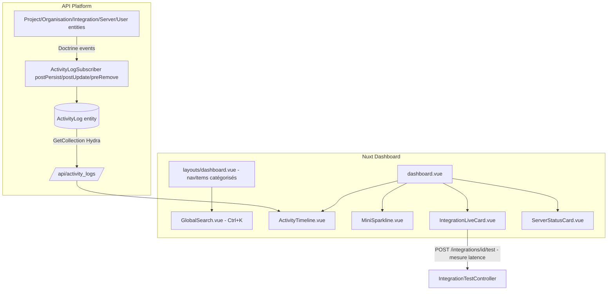

# Requirements

### Overview & Goals
Transformer le `dashboard.vue` actuel (panneau d'administration simple avec 4 KPI et 2 listes) en un véritable centre de pilotage opérationnel inspiré de GitLab / Backstage / Grafana, avec recherche globale, actions rapides, KPI enrichis, état détaillé des serveurs et intégrations, timeline d'activité, et navigation latérale restructurée par catégories.

Ce travail est découpé en plusieurs tâches livrables indépendamment (voir Delivery Steps), à implémenter dans des sessions ultérieures.

### Scope
**In Scope**
- Barre de recherche globale (raccourci Ctrl+K) sur Projets, Organisations, Serveurs, Intégrations.
- Palette d'actions rapides (créer projet, aller aux paramètres LDAP, etc.).
- KPI enrichis avec mini graphiques de tendance (sparklines) sur le dashboard.
- Cartes d'état serveurs détaillées (charge, disponibilité, dernière vérification).
- Cartes d'intégrations "vivantes" avec latence mesurée au moment du test et dernière synchro.
- Timeline d'activité récente basée sur une nouvelle entité backend `ActivityLog`.
- Restructuration du menu latéral (`layouts/dashboard.vue`) en catégories (Pilotage, Ressources, Intégrations, Administration).
- Densité d'information améliorée (grille plus compacte, badges, indicateurs visuels).

**Out of Scope**
- Health-check périodique automatique en tâche de fond (cron) — on réutilise le mécanisme de vérification à la demande existant, en y ajoutant simplement la mesure de latence.
- Graphiques de métriques serveur avancés (CPU/RAM historisés) nécessitant un agent de monitoring externe.
- Notifications push / alerting en dehors de Mercure existant.

### User Stories
- En tant qu'administrateur, je veux rechercher instantanément un projet, un serveur ou une intégration via Ctrl+K, afin de naviguer plus vite sans passer par le menu.
- En tant qu'administrateur, je veux voir en un coup d'œil l'évolution récente des projets/utilisateurs (mini graphiques) pour évaluer la tendance d'activité.
- En tant qu'administrateur, je veux voir la latence mesurée et la dernière vérification de chaque intégration pour diagnostiquer rapidement un problème.
- En tant qu'administrateur, je veux consulter une timeline des actions récentes (créations, modifications, suppressions) pour suivre l'activité de l'équipe.
- En tant qu'utilisateur, je veux un menu latéral organisé par catégories logiques pour trouver plus facilement les sections (Pilotage / Ressources / Intégrations / Administration).

### Functional Requirements
- Le raccourci clavier `Ctrl+K` (`Cmd+K` sur Mac) ouvre une palette de commande (`UCommandPalette` de Nuxt UI) listant projets, organisations, serveurs, intégrations et actions rapides, filtrable en temps réel.
- Chaque carte KPI (Projets, Utilisateurs, Serveurs, Intégrations) affiche un mini graphique en sparkline basé sur l'évolution des 7/30 derniers jours (dérivée des `createdAt` existants côté front, sans backend supplémentaire).
- Les cartes serveurs affichent statut, IP/hôte, nombre d'intégrations rattachées, et un badge de disponibilité.
- Les cartes intégrations affichent le statut, la latence de la dernière vérification (mesurée côté client lors de l'appel `/integrations/{id}/test`), et la date de dernière synchro.
- La timeline d'activité affiche les 10-15 derniers événements (création/modification/suppression de projet, organisation, intégration, serveur, utilisateur) avec icône, auteur, horodatage relatif ("il y a 3 min").
- Le menu latéral (`UNavigationMenu`) regroupe les entrées existantes en sections avec labels de catégorie : Pilotage (Dashboard, Recherche), Ressources (Projets, Organisations, Serveurs, Proxies, Serveurs de déploiement, Utilisateurs), Intégrations, Administration (LDAP, Docs, Guide, Changelog).

### Non-Functional Requirements
- Toutes les nouvelles requêtes API (ActivityLog) doivent suivre le format Hydra/JSON-LD existant et être protégées par les mêmes voters de sécurité que les autres ressources.
- La palette de recherche doit rester réactive avec des jeux de données de quelques centaines d'éléments (filtrage client, pas de nouvel endpoint de recherche côté API dans un premier temps).
- Le nouveau design doit rester cohérent avec le thème Nuxt UI v4 existant (mode clair/sombre) et ne pas casser le générateur `NuxtUi4Generator`.

# Technical Design

### Current Implementation
- `front/app/pages/dashboard.vue` (628 lignes) : page monolithique avec navbar, bannière de bienvenue, 4 cartes KPI simples, 2 listes (projets/utilisateurs récents), état des intégrations, et liens rapides. Toutes les données sont chargées via `useFetchList` (composable `~/composables/api.ts`).
- `front/app/layouts/dashboard.vue` : sidebar Nuxt UI (`UDashboardSidebar` + `UNavigationMenu`) avec deux groupes de liens plats (navigation principale + liens secondaires), pas de catégorisation visuelle.
- Pas d'entité `ActivityLog` côté API (`api/src/Entity/`), pas de mécanisme d'audit trail.
- Le test d'intégration existant (`IntegrationTestController`, endpoint `/integrations/{id}/test`) renvoie `status`, `statusMessage`, `lastCheckedAt` — pas de latence mesurée actuellement (voir `IntegrationList.vue`, `IntegrationShow.vue`, `pages/integrations/index.vue`).
- Pattern d'entité Doctrine + API Platform bien établi (voir `Integration.php`) : `#[ApiResource]`, groupes de sérialisation `xxx:read`/`xxx:write`, `createdAt`/`updatedAt` avec `#[ORM\HasLifecycleCallbacks]`.
- `api/src/EventListener/ProjectIntegrationListener.php` montre le pattern de listener Doctrine existant dans le projet, utilisable comme référence pour capter les événements de création/modification/suppression pour l'`ActivityLog`.

### Key Decisions
- **Timeline d'activité** : nouvelle entité backend `ActivityLog` (validé avec l'utilisateur) alimentée par des Doctrine EventSubscriber (`postPersist`, `postUpdate`, `preRemove`) sur les entités clés (`Project`, `Organisation`, `Integration`, `Server`, `User`), plutôt qu'une dérivation purement frontend — permet un historique tracé et extensible.
- **Latence des intégrations** : pas de health-check périodique backend ; on mesure simplement le temps de réponse côté frontend au moment de l'appel `/integrations/{id}/test` (existant) et on l'affiche/stocke ponctuellement (pas d'historique de tendance de latence dans cette itération).
- **Recherche globale** : filtrage 100% côté client dans un premier temps (agrégation des listes déjà chargées via `useFetchList`), pas de nouvel endpoint de recherche API — plus simple et suffisant vu le volume de données actuel.
- **Sparklines KPI** : calculées côté frontend à partir des `createdAt` des entités déjà récupérées (pas de nouvelle API de séries temporelles).

### Proposed Changes (aperçu, détaillé par tâche dans Delivery Steps)
1. Nouvelle entité `ActivityLog` + repository + EventSubscriber + endpoint `GetCollection` exposé en Hydra.
2. Composant `GlobalSearch.vue` (palette `UCommandPalette` déclenchée par `Ctrl+K`), enregistré globalement dans `layouts/dashboard.vue`.
3. Refonte de `dashboard.vue` : nouvelle bannière + grille de KPI enrichis avec sparklines, section "État des serveurs", section "Intégrations vivantes" avec latence, section "Timeline d'activité".
4. Restructuration de `navItems` dans `layouts/dashboard.vue` avec des groupes labellisés par catégorie.
5. Composable `useActivityLog.ts` et composant `MiniSparkline.vue` réutilisable.

### Data Models / Contracts
```php
// api/src/Entity/ActivityLog.php
#[ORM\Entity(repositoryClass: ActivityLogRepository::class)]
#[ApiResource(
    operations: [new GetCollection(), new Get()],
    normalizationContext: ['groups' => ['activity_log:read']],
    order: ['createdAt' => 'DESC']
)]
class ActivityLog
{
    private ?int $id = null;
    private string $entityType;   // 'project', 'organisation', 'integration', 'server', 'user'
    private string $entityId;
    private string $entityLabel;  // ex: nom du projet au moment de l'action
    private string $action;       // 'created' | 'updated' | 'deleted'
    private ?User $actor = null;
    private \DateTimeImmutable $createdAt;
}
```
```ts
// front/app/types/activitylog.ts
export interface ActivityLog extends Item {
  entityType: 'project' | 'organisation' | 'integration' | 'server' | 'user';
  entityId: string;
  entityLabel: string;
  action: 'created' | 'updated' | 'deleted';
  actor?: { displayName?: string; username?: string } | string;
  createdAt: string;
}
```

### Components
- `front/app/components/dashboard/GlobalSearch.vue` (nouveau) : palette de commande, écoute `Ctrl+K` / `Cmd+K`, agrège projets/organisations/serveurs/intégrations déjà en cache ou re-fetch léger, + actions rapides statiques.
- `front/app/components/dashboard/MiniSparkline.vue` (nouveau) : mini graphique SVG (pas de dépendance chart lourde) affichant une tendance à partir d'un tableau de points.
- `front/app/components/dashboard/ActivityTimeline.vue` (nouveau) : liste chronologique d'`ActivityLog` avec icônes par type d'action/entité.
- `front/app/components/dashboard/IntegrationLiveCard.vue` (nouveau) : carte enrichie avec latence + dernière synchro, remplace le bloc "État des intégrations" existant dans `dashboard.vue`.
- `front/app/components/dashboard/ServerStatusCard.vue` (nouveau) : carte détaillée d'un serveur (statut, hôte, nb intégrations).
- `front/app/layouts/dashboard.vue` (modifié) : `navItems` restructurés en groupes catégorisés, ajout du `GlobalSearch` monté globalement + raccourci clavier.
- `front/app/pages/dashboard.vue` (modifié en profondeur) : nouvelle composition intégrant les composants ci-dessus.

### File Structure
```
api/src/Entity/ActivityLog.php                (nouveau)
api/src/Repository/ActivityLogRepository.php  (nouveau)
api/src/EventSubscriber/ActivityLogSubscriber.php (nouveau)
api/migrations/VersionXXXX_create_activity_log.php (nouveau, via make:migration)

front/app/types/activitylog.ts                 (nouveau)
front/app/composables/useActivityLog.ts        (nouveau)
front/app/components/dashboard/GlobalSearch.vue        (nouveau)
front/app/components/dashboard/MiniSparkline.vue       (nouveau)
front/app/components/dashboard/ActivityTimeline.vue    (nouveau)
front/app/components/dashboard/IntegrationLiveCard.vue (nouveau)
front/app/components/dashboard/ServerStatusCard.vue    (nouveau)
front/app/layouts/dashboard.vue                (modifié)
front/app/pages/dashboard.vue                  (modifié)
```

### Architecture Diagram


### Risks
- L'ajout d'un `EventSubscriber` Doctrine sur plusieurs entités peut avoir un impact de performance sur les opérations en masse (LDAP sync) ; il faudra filtrer les entités concernées et éviter les logs redondants.
- Les migrations Doctrine nécessitent une exécution manuelle (`make:migration` + `doctrine:migrations:migrate`) en environnement Docker ; à documenter dans la tâche backend.
- Le filtrage de recherche 100% client peut devenir lent si le nombre de ressources augmente fortement — accepté comme compromis pour cette itération.

# Delivery Steps

###   Step 1: Créer l'entité backend ActivityLog et l'historisation automatique
L'API expose un endpoint `/api/activity_logs` retournant l'historique des créations/modifications/suppressions des ressources clés.

- Créer l'entité `api/src/Entity/ActivityLog.php` (entityType, entityId, entityLabel, action, actor, createdAt) suivant le pattern de `Integration.php`.
- Créer `ActivityLogRepository` et exposer une `ApiResource` en lecture seule (`GetCollection`, `Get`) triée par `createdAt DESC`, groupe de sérialisation `activity_log:read`.
- Générer et exécuter la migration Doctrine correspondante.
- Créer `api/src/EventSubscriber/ActivityLogSubscriber.php` qui écoute `postPersist`/`postUpdate`/`preRemove` sur `Project`, `Organisation`, `Integration`, `Server`, `User` et enregistre une entrée `ActivityLog` à chaque événement, en capturant l'utilisateur courant via le token de sécurité.

###   Step 2: Générer le client frontend ActivityLog et le composant de timeline
Le dashboard peut afficher une timeline des 10-15 derniers événements récupérés depuis l'API.

- Lancer `pnpm client-generator -r ActivityLog` pour générer les stores Pinia, le composable API et le type `activitylog.ts`.
- Créer `front/app/composables/useActivityLog.ts` qui encapsule la récupération paginée des logs récents.
- Créer `front/app/components/dashboard/ActivityTimeline.vue` affichant chaque entrée avec icône selon `entityType`/`action`, libellé, auteur et horodatage relatif ("il y a X min").

###   Step 3: Implémenter la recherche globale Ctrl+K et les actions rapides
L'utilisateur peut ouvrir une palette de commande via Ctrl+K/Cmd+K pour rechercher projets, organisations, serveurs, intégrations et lancer des actions rapides.

- Créer `front/app/components/dashboard/GlobalSearch.vue` basé sur `UCommandPalette` de Nuxt UI v4.
- Ajouter un listener clavier global (`Ctrl+K`/`Cmd+K`) et un bouton de déclenchement dans la navbar du dashboard.
- Agréger les résultats depuis les listes déjà chargées (projets, organisations, serveurs, intégrations) via `useFetchList`, avec navigation directe vers la ressource sélectionnée.
- Ajouter une section "Actions rapides" statique (Nouveau projet, Paramètres LDAP, Documentation API, etc.).

###   Step 4: Enrichir les KPI du dashboard avec des mini graphiques de tendance
Les 4 cartes KPI du dashboard affichent une mini courbe de tendance basée sur l'évolution récente des entités.

- Créer `front/app/components/dashboard/MiniSparkline.vue`, un composant SVG léger acceptant un tableau de valeurs.
- Calculer, pour chaque KPI (Projets, Utilisateurs, Serveurs, Intégrations), une série de points sur 7/30 jours à partir des `createdAt` déjà récupérés côté `dashboard.vue`.
- Intégrer `MiniSparkline` dans chaque carte KPI existante de `dashboard.vue`, sans casser le comportement de clic/navigation existant.

###   Step 5: Ajouter les cartes détaillées serveurs et intégrations vivantes
Le dashboard affiche des cartes serveurs et intégrations enrichies avec statut, latence mesurée et dernière synchro.

- Créer `front/app/components/dashboard/ServerStatusCard.vue` affichant statut, hôte, type de serveur et nombre d'intégrations rattachées.
- Créer `front/app/components/dashboard/IntegrationLiveCard.vue` remplaçant le bloc "État des intégrations" : mesurer et afficher la latence (temps de réponse) lors de l'appel `/integrations/{id}/test`, ainsi que la dernière date de vérification.
- Intégrer ces deux nouveaux composants dans `dashboard.vue`, dans de nouvelles sections dédiées.

###   Step 6: Restructurer le menu latéral par catégories et finaliser la mise en page du dashboard
Le menu latéral est organisé en groupes logiques (Pilotage, Ressources, Intégrations, Administration) et le dashboard assemble tous les nouveaux blocs dans une mise en page dense et cohérente.

- Modifier `navItems` dans `front/app/layouts/dashboard.vue` pour regrouper les entrées existantes sous des labels de catégorie visibles dans le `UNavigationMenu`.
- Monter le composant `GlobalSearch` globalement dans le layout du dashboard.
- Réorganiser `front/app/pages/dashboard.vue` pour assembler bannière, KPI enrichis, timeline d'activité, cartes serveurs/intégrations et accès rapides dans une grille plus dense, en conservant le support clair/sombre existant.