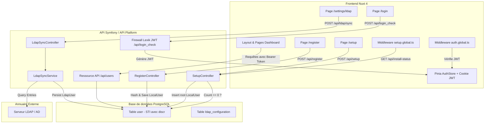

# Requirements

### Overview & Goals
Ce projet a pour objectif d'optimiser l'expérience utilisateur et l'intégrité opérationnelle en branchant une gestion rigoureuse des identités et des accès. L'application doit garantir une transition fluide et sécurisée entre la première installation, l'enregistrement des utilisateurs locaux et l'intégration des annuaires d'entreprise LDAP.

Les finalités majeures sont :
- Garantir qu'une instance sans utilisateur bascule automatiquement vers une phase de configuration initiale (Setup) pour définir le compte superadministrateur (`root`).
- Protéger l'ensemble des fonctionnalités du Dashboard au sein d'une zone strictement authentifiée par jetons JWT.
- Permettre l'enregistrement autonome de nouveaux utilisateurs locaux (`LocalUser`).
- Assurer l'interopérabilité avec les annuaires LDAP via une synchronisation directe pilotée depuis les paramètres de l'application.
- Conserver une structure de données unifiée et performante en séparant nettement les deux types d'utilisateurs à l'aide d'une table discriminante Doctrine (`Single Table Inheritance`).

### Scope
#### In Scope
- **Détection dynamique de l'état d'installation** : remplacement du mécanisme basé sur fichier par le comptage effectif dans la table `user`.
- **Modèle de données polymorphe** : mise en place de la hiérarchie `User`, `LocalUser` et `LdapUser` en Single Table Inheritance.
- **Workflow de Setup initial** : création contrôlée de l'unique superadministrateur initial avec mot de passe fort et assignation du rôle `ROLE_SUPER_ADMIN`.
- **Authentification & session frontend** : connexion via `/api/login_check`, gestion du token JWT dans Nuxt, garde de navigation sur toutes les pages Dashboard, et affichage dynamique de l'utilisateur connecté dans le layout.
- **Inscription locale** : page `/register` et endpoint sécurisé pour la création de comptes locaux `ROLE_USER`.
- **Synchronisation LDAP dans les Paramètres** : déclenchement synchrone d'importation depuis l'interface de gestion avec retour direct sur le nombre de comptes créés et mis à jour.
- **Visualisation distincte dans l'interface** : affichage du statut de provenance (Local ou LDAP) dans la liste et les détails des utilisateurs.

#### Out of Scope
- Authentification SSO directe (SAML / OAuth2 / OIDC).
- Authentification par délégation bind LDAP en temps réel au moment du login (les utilisateurs LDAP sont synchronisés dans la base locale).
- Réinitialisation de mot de passe par email sortant (pourra faire l'objet d'une phase ultérieure).

### User Stories
- **En tant que premier opérateur déployant la plateforme**, je suis automatiquement redirigé vers l'écran de configuration pour créer le compte superadministrateur (`root`), afin de poser les bases de la sécurité du système sans configuration manuelle en base.
- **En tant qu'utilisateur non authentifié**, si j'essaie d'accéder au tableau de bord ou aux entités de gestion, je suis redirigé vers l'écran de connexion afin de protéger les données confidentielles.
- **En tant que nouveau collaborateur local**, je peux m'inscrire depuis le formulaire de création de compte afin d'obtenir un accès standard avec mon adresse email et mon mot de passe.
- **En tant qu'administrateur**, je peux accéder aux paramètres de l'application pour tester la connexion LDAP et lancer la synchronisation afin d'importer immédiatement les membres de l'organisation.
- **En tant qu'administrateur**, je peux visualiser dans la gestion des utilisateurs la provenance de chaque compte (Local ou LDAP) pour une gouvernance claire des accès.

### Functional Requirements
- **Redirection automatique vers Setup** : si la table `user` contient 0 enregistrement, toute navigation web ou appel API non exempté redirige vers `/setup`.
- **Verrouillage du Setup** : dès lors qu'un premier utilisateur existe, l'accès à `/setup` et l'endpoint `POST /api/setup` sont définitivement interdits (HTTP 403 / redirection vers `/login`).
- **Garde de sécurité Nuxt** : les routes utilisant le layout `dashboard` (`/dashboard`, `/projects`, `/organisations`, `/integrations`, `/users`, `/settings`) exigent un jeton JWT valide. Si absent ou expiré, redirection vers `/login` avec conservation de l'URL cible.
- **Transmission du Bearer Token** : toute requête cliente vers l'API Platform doit contenir l'en-tête `Authorization: Bearer <token>`.
- **Inscription locale** : formulaire public avec validation d'email, complexité de mot de passe et confirmation.
- **Synchronisation LDAP paramétrable** : bouton d'action dans les paramètres déclenchant un appel API synchrone, effectuant le mapping LDAP (UID, email, nom, prénom) et créant ou actualisant les entités `LdapUser`.

# Technical Design

### Current Implementation
L'application repose sur une API Symfony / API Platform et un frontend Nuxt 4 avec Nuxt UI v4 :
- **API Setup actuelle** : `SetupController` vérifie l'existence physique du fichier `config/install.lock`. Cette approche est fragile en conteneur éphémère et ne reflète pas l'état réel de la base de données.
- **Sécurité API** : Le bundle `LexikJWTAuthenticationBundle` est configuré sur `/api/login_check` avec le provider `app_user_provider` pointant sur `App\Entity\User`.
- **Frontend** :
  - `front/app/pages/login.vue` contient une maquette statique sans liaison API.
  - `front/app/layouts/dashboard.vue` contient des données d'utilisateur mockées ("Admin") et aucun système de déconnexion fonctionnel.
  - `front/app/middleware/setup.global.ts` interroge `/api/install-status` mais dépend du fichier de lock.
- **LDAP existant** :
  - L'entité `App\Entity\LdapConfiguration` est déjà définie avec host, port, baseDn, bindDn et un endpoint de test `/ldap_configurations/test`.
  - La commande `App\Command\SyncLdapUsersCommand` fournit une première ébauche d'interrogation de l'annuaire mais manipule directement l'entité unique `User`.

### Key Decisions
- **Modèle d'héritage en base : Single Table Inheritance (STI)** :
  - *Choix* : Utiliser une seule table physique `user` avec une colonne discriminante `discr` gérée par Doctrine ORM.
  - *Bénéfice* : Évite les jointures coûteuses tout en garantissant l'intégrité référentielle, l'unicité globale des emails et la compatibilité naturelle avec `lexik_jwt_authentication` et `app_user_provider`.
- **Ressource API Platform unifiée avec opérations spécialisées** :
  - *Choix* : Exposer `/api/users` pour la consultation et l'administration globale, complété par une opération `POST /api/register` (ou ressource `LocalUser`) pour l'inscription locale et `POST /api/ldap/sync` pour l'annuaire.
  - *Bénéfice* : Fournit une interface utilisateur consolidée tout en encapsulant les règles métier propres à chaque type d'utilisateur.
- **Synchronisation LDAP synchrone directe** :
  - *Choix* : Déclenchement via un endpoint contrôleur dédié `POST /api/ldap/sync` renvoyant un rapport immédiat au frontend.
  - *Bénéfice* : Offre une rétroaction instantanée sans exiger la mise en place d'une infrastructure de workers asynchrones plus lourde à maintenir.
- **Gestion de session par Cookie sécurisé et Pinia** :
  - *Choix* : Stocker le jeton JWT dans un cookie sécurisé (compatible SSR/CSR) couplé à un store Pinia réactif `useAuthStore`.
  - *Bénéfice* : Permet une vérification transparente dans les middlewares globaux Nuxt dès le premier rendu serveur.

### Architecture Diagram


### Data Models / Contracts

#### 1. Entités Doctrine
```php
namespace App\Entity;

use Doctrine\ORM\Mapping as ORM;
use Symfony\Component\Security\Core\User\UserInterface;
use Symfony\Component\Serializer\Annotation\Groups;

#[ORM\Entity(repositoryClass: UserRepository::class)]
#[ORM\Table(name: '`user`')]
#[ORM\InheritanceType('SINGLE_TABLE')]
#[ORM\DiscriminatorColumn(name: 'discr', type: 'string')]
#[ORM\DiscriminatorMap(['local' => LocalUser::class, 'ldap' => LdapUser::class])]
abstract class User implements UserInterface
{
    #[ORM\Id]
    #[ORM\GeneratedValue]
    #[ORM\Column]
    #[Groups(['user:read'])]
    protected ?int $id = null;

    #[ORM\Column(length: 180, unique: true)]
    #[Groups(['user:read', 'user:write'])]
    protected ?string $email = null;

    #[ORM\Column(length: 180, nullable: true)]
    #[Groups(['user:read', 'user:write'])]
    protected ?string $username = null;

    #[ORM\Column(type: 'json')]
    #[Groups(['user:read', 'user:write'])]
    protected array $roles = [];

    #[Groups(['user:read'])]
    public function getType(): string
    {
        return $this instanceof LocalUser ? 'local' : 'ldap';
    }
}
```

```php
namespace App\Entity;

use Doctrine\ORM\Mapping as ORM;
use Symfony\Component\Security\Core\User\PasswordAuthenticatedUserInterface;
use Symfony\Component\Serializer\Annotation\Groups;

#[ORM\Entity]
class LocalUser extends User implements PasswordAuthenticatedUserInterface
{
    #[ORM\Column]
    protected ?string $password = null;

    #[Groups(['user:write'])]
    protected ?string $plainPassword = null;
}
```

```php
namespace App\Entity;

use Doctrine\ORM\Mapping as ORM;
use Symfony\Component\Serializer\Annotation\Groups;

#[ORM\Entity]
class LdapUser extends User
{
    #[ORM\Column(length: 255, nullable: true)]
    #[Groups(['user:read'])]
    protected ?string $ldapUid = null;

    #[ORM\Column(length: 255, nullable: true)]
    #[Groups(['user:read'])]
    protected ?string $distinguishedName = null;

    #[ORM\Column(type: 'datetime_immutable', nullable: true)]
    #[Groups(['user:read'])]
    protected ?\DateTimeImmutable $syncedAt = null;
}
```

#### 2. DTO et réponse de synchronisation LDAP
```json
{
  "status": "success",
  "created": 12,
  "updated": 5,
  "total": 17,
  "errors": []
}
```

### Components & File Structure
- **Backend (`api/src/`)** :
  - `Entity/User.php` (classe de base abstraite STI)
  - `Entity/LocalUser.php` (classe dérivée locale)
  - `Entity/LdapUser.php` (classe dérivée synchronisée)
  - `Repository/UserRepository.php` (méthodes d'inspection et filtrage par type)
  - `Controller/SetupController.php` (contrôle dynamique par le comptage d'utilisateurs)
  - `Controller/RegisterController.php` (endpoint d'inscription locale)
  - `Controller/LdapSyncController.php` (déclenchement synchrone)
  - `Service/LdapSyncService.php` (extraction LDAP et synchronisation Doctrine)
  - `EventListener/InstallListener.php` (interception de requêtes et redirection si table vide)
- **Frontend (`front/app/`)** :
  - `middleware/setup.global.ts` (contrôle d'installation et routage vers `/setup`)
  - `middleware/auth.global.ts` (garde d'authentification pour la zone Dashboard)
  - `stores/auth.ts` (store Pinia de session utilisateur et token JWT)
  - `composables/api.ts` (injection du Bearer token dans les requêtes `$fetch` et `useFetch`)
  - `pages/login.vue` (formulaire de connexion branché à `/api/login_check`)
  - `pages/register.vue` (formulaire de création de compte local)
  - `pages/setup.vue` (formulaire de configuration du superadministrateur initial)
  - `pages/settings/ldap.vue` (configuration, test et bouton de synchronisation LDAP)
  - `layouts/dashboard.vue` (barre latérale avec utilisateur connecté, lien paramètres et déconnexion)
  - `pages/users/index.vue` (liste avec distinction visuelle Local / LDAP)

### Risks & Mitigations
- **Risque d'écrasement d'un compte local par une synchronisation LDAP** : un utilisateur ayant créé un compte local avec le même email pourrait être corrompu par la synchronisation LDAP.  
  *Mitigation* : Le service de synchronisation vérifie si un compte existant sous cet email est de type `LocalUser`. Si oui, l'utilisateur local est préservé ou un log d'avertissement est émis sans écraser son mot de passe.
- **Risque de boucle de redirection si l'API est temporairement indisponible** : si `/api/install-status` échoue, Nuxt pourrait boucler indéfiniment.  
  *Mitigation* : Gestion robuste des erreurs dans `setup.global.ts` avec affichage d'un écran d'erreur clair sans redirection aveugle.
- **Délai d'exécution LDAP (Timeout)** : une requête LDAP sur un gros annuaire pourrait bloquer la requête HTTP.  
  *Mitigation* : Application de filtres de recherche stricts (`objectClass=person`, pagination LDAP `ldap_control_paged_result` si supporté) et timeout configurable sur le bind.

# Testing

### Validation Approach
La validation sera effectuée de bout en bout en simulant l'ensemble du cycle de vie de l'application : initialisation à vide, verrouillage du setup, inscription locale, connexion sécurisée, et synchronisation LDAP.

### Key Scenarios
- **Scénario 1 : Détection initiale et exécution du Setup**
  1. Partir d'une table `user` vierge (`count === 0`).
  2. Tenter d'accéder à `/` ou `/dashboard` -> Vérifier la redirection automatique vers `/setup`.
  3. Remplir le formulaire avec l'adresse du superadministrateur et un mot de passe robuste.
  4. Valider -> Constater la création en base d'un `LocalUser` ayant `ROLE_SUPER_ADMIN`.
  5. Tenter de réaccéder à `/setup` -> Constater l'interdiction d'accès (redirection vers `/login` ou 403).

- **Scénario 2 : Connexion et protection du Dashboard**
  1. Tenter d'accéder directement à `/dashboard` sans être connecté -> Vérifier la redirection immédiate vers `/login`.
  2. S'authentifier avec les identifiants créés lors du Setup.
  3. Vérifier la réception du jeton JWT et sa persistance en cookie.
  4. Vérifier l'arrivée sur le Dashboard avec les informations réelles de l'administrateur affichées dans le pied de barre latérale de `dashboard.vue`.
  5. Cliquer sur le bouton de déconnexion -> Vérifier la purge du jeton et le retour vers `/login`.

- **Scénario 3 : Inscription autonome d'un utilisateur local**
  1. Se rendre sur `/register` depuis le lien présent sur `/login`.
  2. Soumettre un formulaire d'inscription valide.
  3. Vérifier la création d'une entrée `LocalUser` avec rôle `ROLE_USER` et mot de passe correctement hashé.
  4. Vérifier la capacité de cet utilisateur à se connecter immédiatement via `/login`.

- **Scénario 4 : Synchronisation LDAP depuis les paramètres**
  1. Se connecter avec le compte Superadmin ou Administrateur.
  2. Accéder à l'interface `/settings/ldap`.
  3. Tester la connectivité LDAP avec les identifiants configurés (`/ldap_configurations/test`).
  4. Cliquer sur le bouton « Lancer la synchronisation ».
  5. Vérifier la réponse API renvoyant le décompte des utilisateurs traités.
  6. Aller sur la page `/users` et constater la présence des utilisateurs créés sous le type `LdapUser` avec le badge `LDAP`.

### Edge Cases
- **Tentative d'enregistrement avec un email déjà existant** : l'API et le formulaire Nuxt doivent remonter une violation explicite sans planter l'application.
- **Serveur LDAP inaccessible** : le test de connexion et la synchronisation doivent capturer l'exception LDAP et afficher une alerte claire sans laisser la requête en suspens.
- **Expiration du jeton JWT** : l'intercepteur API doit détecter le code HTTP 401, purger le cookie de session et rediriger l'utilisateur vers `/login`.

### Test Changes
- **Tests unitaires Symfony (`api/tests/`)** :
  - `UserRepositoryTest` : vérification de la méthode `hasAnyUser()` et de l'instanciation discriminante `LocalUser` vs `LdapUser`.
  - `LdapSyncServiceTest` : simulation d'un flux d'entrées LDAP avec vérification de la persistance des nouveaux comptes.
- **Tests d'intégration d'API** :
  - `SetupControllerTest` : vérification de la transition d'état et du blocage post-setup.
  - `SecurityAuthenticationTest` : validation de la route `/api/login_check` et de la génération du JWT.
- **Tests End-to-End (`e2e/`)** :
  - Scénario complet Playwright : Redirection Setup -> Création Root -> Connexion Dashboard -> Vérification Session.

# Delivery Steps

###   Step 1: Modélisation STI Doctrine et détection dynamique de setup
La base de données et l'API distinguent rigoureusement les utilisateurs locaux et LDAP via Single Table Inheritance (STI), et le statut d'installation dépend de la vacuité de la table `user`.

- Refactoriser `App\Entity\User` en entité abstraite ou classe de base avec `#[ORM\InheritanceType('SINGLE_TABLE')]`, `#[ORM\DiscriminatorColumn(name: 'discr', type: 'string')]` et `#[ORM\DiscriminatorMap(['local' => LocalUser::class, 'ldap' => LdapUser::class])]`.
- Créer l'entité `App\Entity\LocalUser` pour encapsuler le mot de passe hashé, la gestion du mot de passe en clair (`plainPassword`) et le processeur de hachage `UserPasswordHasherProcessor`.
- Créer l'entité `App\Entity\LdapUser` pour stocker les attributs spécifiques à l'annuaire (`ldapUid`, `distinguishedName`, `syncedAt`) sans stockage de mot de passe local.
- Adapter `App\Repository\UserRepository` pour ajouter la méthode `hasAnyUser(): bool` ou `countUsers(): int`.
- Mettre à jour `App\Controller\SetupController::status()` et `App\EventListener\InstallListener` pour interroger l'existence d'utilisateurs en base plutôt que la seule présence de `install.lock`.
- Mettre à jour `App\Controller\SetupController::setup()` pour créer le premier utilisateur Superadmin (`root`) sous forme d'une instance `LocalUser` avec le rôle `ROLE_SUPER_ADMIN` et bloquer toute exécution ultérieure.
- Générer et appliquer la migration Doctrine correspondante pour la nouvelle colonne discriminante.

###   Step 2: Système d'authentification JWT, garde Dashboard et inscription locale
La zone d'administration Dashboard est hermétiquement protégée par JWT, l'authentification est effective côté Nuxt, et les utilisateurs locaux peuvent s'inscrire en autonomie.

- Configurer le contrôleur/action d'inscription locale `App\Controller\RegisterController` ou opération API Platform sur `LocalUser` sécurisant la création de compte avec `ROLE_USER`.
- Créer le store Pinia d'authentification `front/app/stores/auth.ts` gérant le token JWT stocké via `useCookie('jwt_token')`, l'état de l'utilisateur courant et les actions `login`, `logout` et `fetchCurrentUser`.
- Mettre en place le middleware global de sécurité frontend `front/app/middleware/auth.global.ts` redirigeant tout utilisateur non connecté tentant d'accéder aux routes sous layout `dashboard` vers `/login`.
- Adapter `front/app/composables/api.ts` pour injecter automatiquement l'en-tête HTTP `Authorization: Bearer <token>` sur l'ensemble des requêtes sécurisées.
- Connecter le formulaire `front/app/pages/login.vue` à l'endpoint `/api/login_check` avec gestion des erreurs et redirection vers le dashboard ou la route demandée.
- Créer la page `front/app/pages/register.vue` avec validation Nuxt UI / Zod permettant l'enregistrement d'un utilisateur local.
- Mettre à jour `front/app/layouts/dashboard.vue` pour afficher l'identité réelle de l'utilisateur connecté dans la barre latérale et activer le bouton de déconnexion.

###   Step 3: Synchronisation LDAP synchrone et interface de paramètres
Les administrateurs peuvent configurer et synchroniser à la demande les comptes utilisateurs LDAP depuis l'espace de paramètres avec un compte-rendu immédiat.

- Créer le service métier `App\Service\LdapSyncService` exploitant l'entité existante `LdapConfiguration` pour se connecter au serveur LDAP, interroger l'annuaire, et persister/mettre à jour les instances de `LdapUser`.
- Créer le contrôleur `App\Controller\LdapSyncController` exposant l'opération `POST /api/ldap_configurations/sync` ou `POST /api/ldap/sync` accessible aux administrateurs (`ROLE_ADMIN`) et renvoyant le compte-rendu d'exécution (comptes créés, mis à jour, ignorés).
- Créer la page de paramètres d'annuaire `front/app/pages/settings/ldap.vue` (ou onglet Paramètres) permettant de tester la liaison LDAP et de déclencher la synchronisation synchrone directe.
- Intégrer l'accès aux paramètres dans le menu latéral `front/app/layouts/dashboard.vue`.
- Adapter la vue `front/app/pages/users/index.vue` pour afficher clairement le badge de provenance (Local vs LDAP) et fournir un bouton d'action rapide de synchronisation pour les administrateurs.